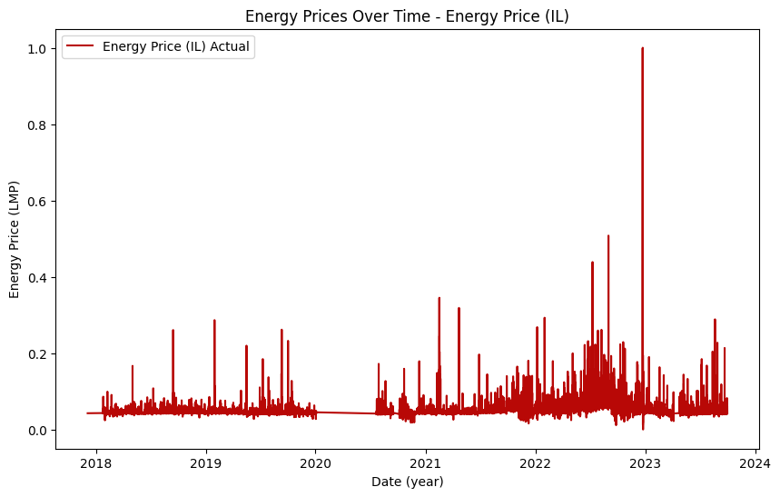

# IE 534 - Deep Dive Project
# 
Group 31  
Project 7

## Team members
Noel Mrowiec (mrowiec3@illinois.edu)  
Hanliang Jiang (hj33@illinois.edu)  
Hong-Ming Chiu (hmchiu2@illinois.edu)  

## Overview
This is the final project for IE 534 / CS 547 Deep Learning at the UIUC. The final project is known as a deep dive project. The project was separated into five milestones.

## Problem Statement
For this project, we will be predicting the price of energy provided by MISO (Midcontinent Independent System Operator). We are given different features, including Forecasted Load, Day Ahead Energy Price, Time, Energy prices in surrounding states and Predicted weather, and will be using recurrent neural networks to predict the price. The label (actual energy price) is the ground truth. We will try to predict the label.  

Label: 
-Actual Energy Price (http://www.energyonline.com/Data/GenericData.aspx?DataId=8&MISO___Actual_Energy_Price) for ILLINOIS.HUB

Features: 
-Forecasted Load 
-Day Ahead Energy Price 
-Day of Week 
-Hour of Day 
-Month 
-Energy prices in surrounding states 
-Daily temperature 

## Data
The data for this project is from various sources. 

- Forecasted Load, Day Ahead Energy Price, Energy prices in surrounding states and the corresponding dates all comes from http://www.energyonline.com/Data
- The temperature reading comes from https://www.sciencebase.gov/catalog/item/660ad9d2d34e4df16bd58a23

## Features
We will use the following columns in the dataset as feature:

- Sin_Month, Cos_Month: Month in cyclical data format  
- Sin_Day, Cos_Day: Day of the week in cyclical data format  
- Sin_Hour, Cos_Hour: Hour of the day in cyclical data format  
- Temperature: Air temperature at Argonne National Laboratory in Lemont, Illinois in degrees degree Fahrenheit  
- Forecasted Load (MISO): Forecasted Load from MISO in LMP  
- Day Ahead Energy Price (IL): Day Ahead Energy Price at Illinois in LMP  
- Energy Price (MICHIGAN.HUB): Energy Price at Michigan hub in LMP  
- Energy Price (INDIANA.HUB): Energy Price at Indiana hub in LMP  
- Energy Price (ARKANSAS.HUB): Energy Price at Arkansas hub in LMP  

Note: all energy prices are in Locational marginal pricing (LMP) units. Please see https://www.enverus.com/blog/an-intro-to-locational-marginal-pricing/ for more information.  

Note: the milestones gives a description about why we used a cyclical data format for the date.   

Milestone 1: For this milestone, we first figured out the layout of the dataset, and divided the dataset into debugging set and working set. We then pickled the data for future use.

Milestone 2: There are two parts of this milestone, the data exploration part visualizes all different sources of data, while the linear regression fit the data in a simple linear model and showcase the accuracy of the model. It is worth noticing that after visualizing different sources of data, we decided to trim the data to a unified time span, which is data cleaning work.

Milestone 3: For this milestone, we trained a Recurrent Neural Network and experimented with mini batch method on the dataset.

Milestone 4: For this milestone, we evaluated feature importance for each different features by dropping out every feature separately and retrain the model. By the difference of accuracy rate between different features dropped out, we drew the conclusion that the energy price in Indiana has the most influence on the prediction.

Conclusions:
■ Should motivate problem 

■ Discuss technical challenges or lessons learned in project.

■ Should discuss conclusions (feature importance?), particularly for possible stakeholders 

Overall, we found that a recurrent neural network (RNN) worked well for predicting the energy 
price of Illinois. Our model correctly predicts the energy price 
within 10% of the actual price 78% of the time.

The goal of predicting energy prices is to provide a way for customers and energy provider to save money. 
Energy predictions "sends accurate price signals to generators and customers, informing them when and 
where power is cheap or expensive. Market participants benefit from access to transparent real-time data 
to make reliable decisions about investment, resulting in more innovation, efficiency, reliability and 
market liquidity." [1] Accurate predictions are import because it will save more money. 

Over the course of our project, we learned that data cleaning and manipulation is very important. As we progressed through milestones, we spent the majority of our time adjusting our dataset. During milestone 1, we included all of the data. In the later milestones, we have to go back and adjust our data. Below is a list of how we had to adjust our data:
 - Merging data:
    We had 3 CSV files and one text file. The text file included the temperature data. The CSV files included all the other data. It took some adjustments to merge all of the files together correctly.  Initially, the other states actual energy cost were all in one feature. In the later milestones, we separated 
 - Changed dates to cyclical date: 
    The prices of energy varies by time of of day and the season. Cold and hot months use more energy. Additionally, more energy is consumed during the daytime on a weekday than at nigh or weekends [2]. Since our data is samples overtime (approximately every hour), it made more sense to use cyclical data format instead of treating the month as categorical data and the day of the week and hour of the day as categorical or continuous data [3]. Changing the dates to sine and cosine (cyclical data) better represented the cyclical natural of the time, day of the week, and month. 
 - Selected date-range with complete data: 
    There were periods of time that did not have samples. In the image below, we can see that in 2020 there was a long period of time without any recorded energy prices. 
      
    Other features had similar missing samples. Thus, we decided to drop a sample if any of the features were not recorded. This allowed us to only include samples over specific date ranges. 
 - Feature selection: Although the original data included other MISO hubs like Texas and Louisiana, we only kept Minnasota, Indiana, and  
    

### References:
[1]S. Ozkan, “An Intro to Locational Marginal Pricing | Enverus,” www.enverus.com, Jan. 05, 2022. https://www.enverus.com/blog/an-intro-to-locational-marginal-pricing/

[2]T. Hodge, “Hourly electricity consumption varies throughout the day and across seasons - Today in Energy - U.S. Energy Information Administration (EIA),” www.eia.gov, Feb. 21, 2020. https://www.eia.gov/todayinenergy/detail.php?id=42915

[3]“How to Handle Cyclical Data in Machine Learning | Better Data Science,” betterdatascience.com. https://betterdatascience.com/cyclical-data-machine-learning/

## MIT License

Copyright (c) 2019-2024 
Permission is hereby granted, free of charge, to any person obtaining a copy
of this software and associated documentation files (the "Software"), to deal
in the Software without restriction, including without limitation the rights
to use, copy, modify, merge, publish, distribute, sublicense, and/or sell
copies of the Software, and to permit persons to whom the Software is
furnished to do so, subject to the following conditions:

The above copyright notice and this permission notice shall be included in all
copies or substantial portions of the Software.

THE SOFTWARE IS PROVIDED "AS IS", WITHOUT WARRANTY OF ANY KIND, EXPRESS OR
IMPLIED, INCLUDING BUT NOT LIMITED TO THE WARRANTIES OF MERCHANTABILITY,
FITNESS FOR A PARTICULAR PURPOSE AND NONINFRINGEMENT. IN NO EVENT SHALL THE
AUTHORS OR COPYRIGHT HOLDERS BE LIABLE FOR ANY CLAIM, DAMAGES OR OTHER
LIABILITY, WHETHER IN AN ACTION OF CONTRACT, TORT OR OTHERWISE, ARISING FROM,
OUT OF OR IN CONNECTION WITH THE SOFTWARE OR THE USE OR OTHER DEALINGS IN THE
SOFTWARE.

